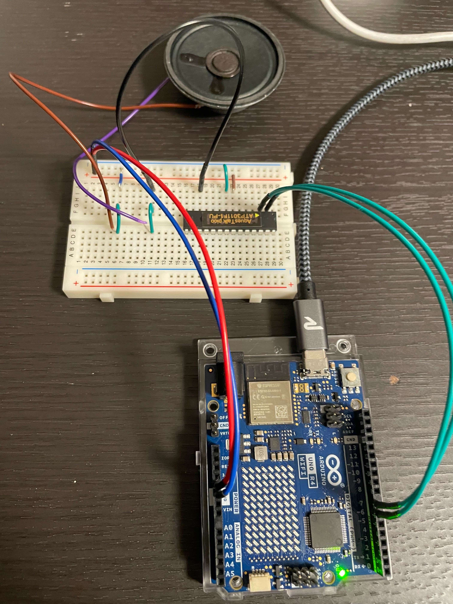

## 概要
音声合成LSI 「AquesTalk pico LSI」を利用して読み上げをするテスト

## 部品
- Arduino UNO R4 WiFi
- [ダイナミックスピーカー 50mmΦ 8Ω 0.4W](https://akizukidenshi.com/catalog/g/g109013/)
- [音声合成LSI ATP3011F1-PU(ゆっくりな女性の音声)](https://akizukidenshi.com/catalog/g/g106220/)

## 配線

## 参考資料
[音声合成LSI  - AquesTalk pico LSI](https://www.a-quest.com/products/aquestalkpicolsi.html)
