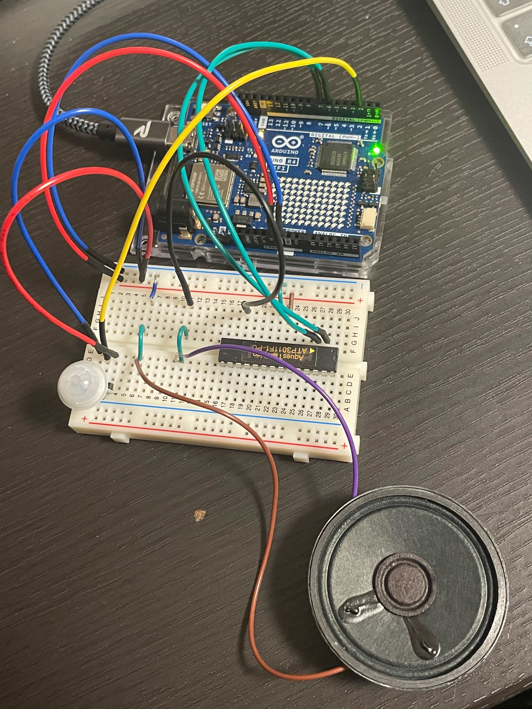

## 概要
天気予報APIからお天気情報を取得してお洗濯情報などを教えてくれる

## 部品
- Arduino UNO R4 WiFi
- [ダイナミックスピーカー 50mmΦ 8Ω 0.4W](https://akizukidenshi.com/catalog/g/g109013/)
- [音声合成LSI ATP3011F1-PU(ゆっくりな女性の音声)](https://akizukidenshi.com/catalog/g/g106220/)

## 天気情報API
- Open-Meteo JMA API

## 配線

## 参考資料
- [音声合成LSI  - AquesTalk pico LSI](https://www.a-quest.com/products/aquestalkpicolsi.html)
- [UNO R4 WiFi Network Examples | Arduino Documentation](https://docs.arduino.cc/tutorials/uno-r4-wifi/wifi-examples/)
- [ArduinoHttpClient | Arduino Documentation](https://docs.arduino.cc/libraries/arduinohttpclient)
- [ArduinoJson](https://arduinojson.org)
